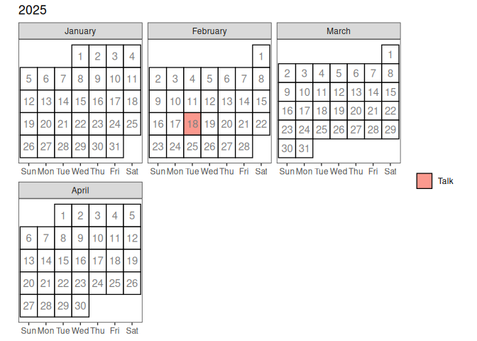

Nebraska R User Group
================

Sign up for the Nebraska R User Group on
[meetup](https://www.meetup.com/neb-rug/).

## Our Events

<!-- -->

| Date | Title | Speaker | Slides |
|:---|:---|:---|:---|
| 2024-10-29 | Meetup |  |  |
| 2024-12-04 | Extensions to ggplot2 are easy – right? | [Heike Hofmann](https://github.com/heike) | [html](https://heike.github.io/NebRUG-2024/2024-12-04-ggplot2-extensions/ggplot2-extensions.html), [pdf](https://heike.github.io/NebRUG-2024/2024-12-04-ggplot2-extensions/ggplot2-extensions.pdf) |
| 2025-02-18 | Talking to LLMs Through R | [Matt Waite](https://github.com/mattwaite) |  |
