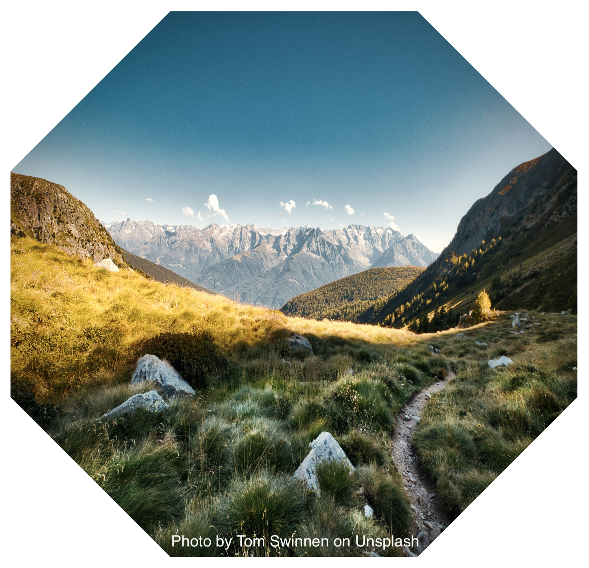
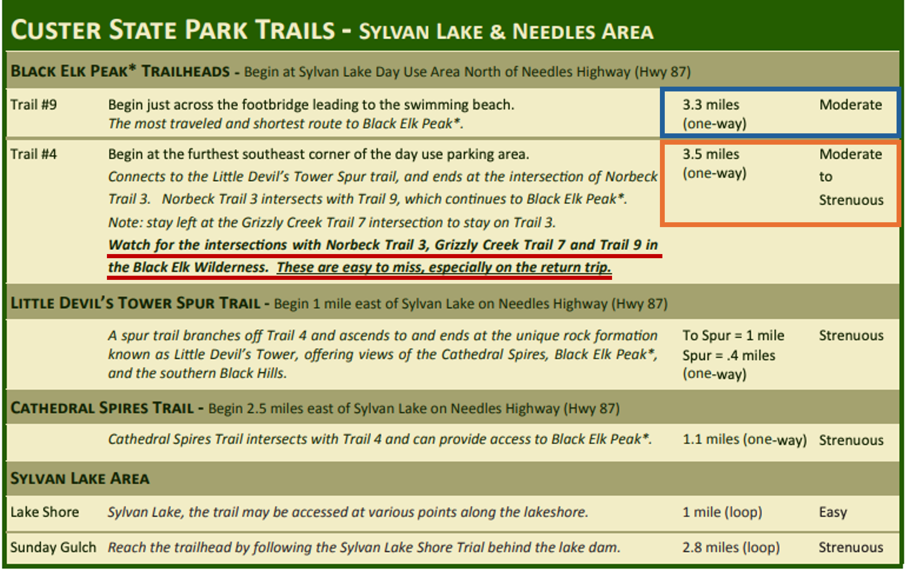
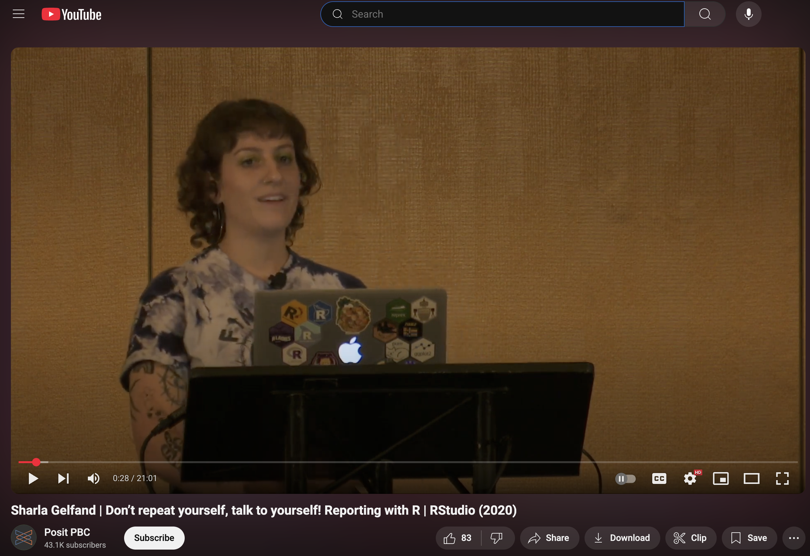
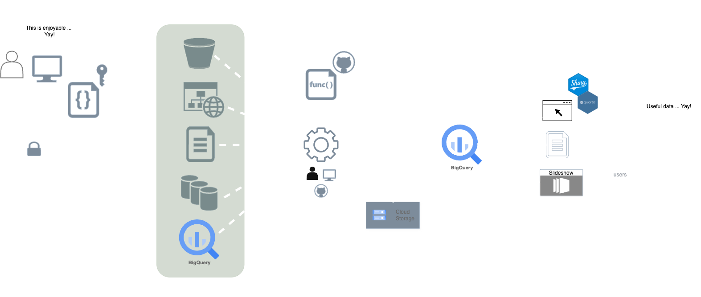
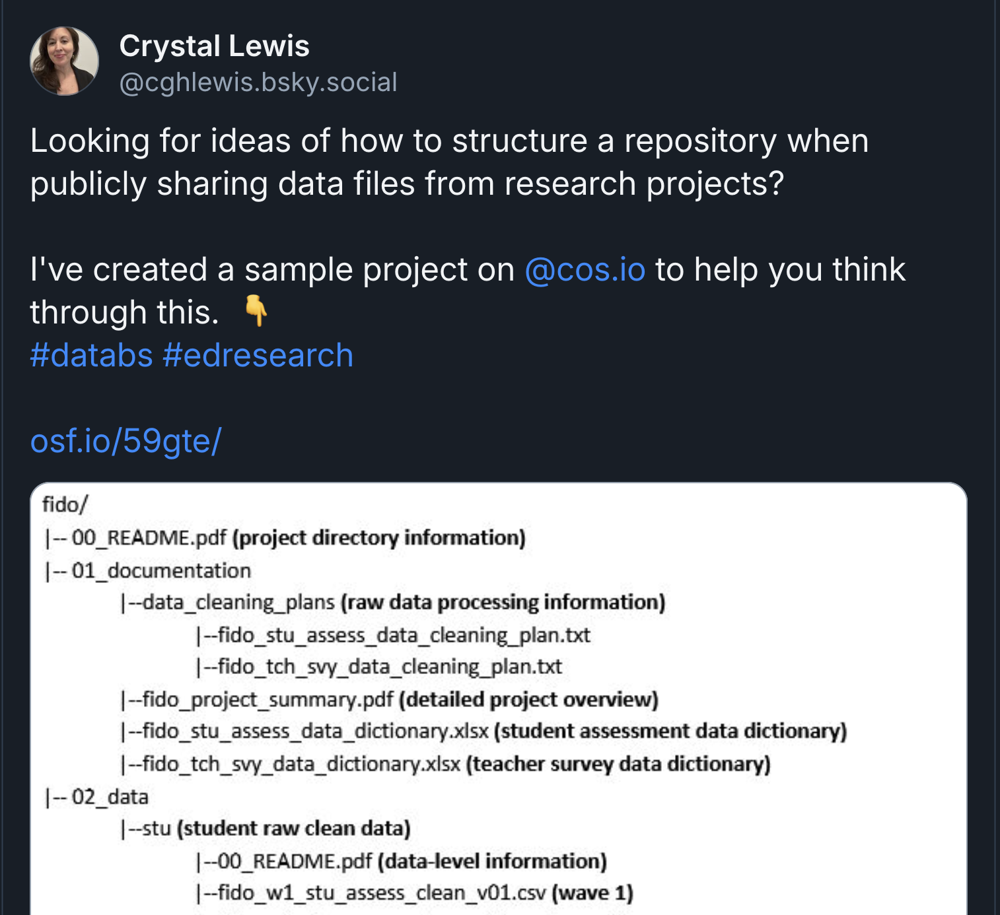

## {.theme-title1 .center}

### Failing upward with R

#### Challenges faced and hard truths learned by a small but scrappy data team on their path to impact

<hr>

##### Collin K. Berke, Ph.D., Media Research Analyst, Nebraska Public Media
##### `r fontawesome::fa("github", "white")` &nbsp; [@collinberke](https://github.com/collinberke)
##### `r fontawesome::fa("linkedin", "white")` &nbsp; [collinberke](https://linkedin.com/in/collinberke/)
##### `r fontawesome::fa("bluesky", "white")` &nbsp; [collinberke.bsky.social](https://bsky.app/profile/collinberke.bsky.social)

{.absolute top=150 right=0 width="260" height="250"}

## 👋 Hi, I'm Collin {.slide-content}

{.absolute left=430 top=75 width=215 height=215}

<br>
<br>
<br>
<br>

- Media Research Analyst at Nebraska Public Media.
- Goal is to use data to answer questions on how to best reach and engage audiences.
- Developing open source tools and utilizing cloud computing resources to achieve this goal.

## My dreams {.slide-content}

- Do something significant with data ✅
- Teach at a university like UNL ✅
- Be a positive influence for the state and people living in Nebraska ✅
- Win a national championship as a Black Shirt defensive lineman

::: {.notes}
This is a joke, since the CB3 is located in memorial stadium--the greatest college sports venue of all time.
:::

## A few disclaimers {background-color="#000000"}

- No proprietary information or data is shared here.
- The views expressed in this presentation do not represent those of Nebraska Public Media.
- What you hear here are very opinionated ways of working (there are likely other, better ways)

::: {.notes}
* My goal is to highlight some of the workflows my team has found useful.
:::

---

[Your mileage *will* vary ... 🚗💨]{.text-center-emphasis}

## {background-color="black"}



::: {.notes}
* 8hrs and 26mins from Lincoln, NE to Custer State Park, Western SD
* I want to take you to the top of Black Elk Peak--previously known as Harney Peak (elevation of 7,242 feet).
* The highest point between the Rocky Mountains and the Pyrenees Mountains in France. (The highest point east of the Rocky Mountains)
* Two trails #9 and #4
* This is the allegory I'll use to highlight how through failure and having to learn hard lessons, my team has found success using R and open source tools to create impact.
:::

## {background-image="images/custer-trails-google-earth.png"}

---



## Where are we going today? 🧭 {.slide-content}

* Be introduced to workflows our team uses to stay **RAD: Reproducible, Automated, and Documented.**
* Observe how our team utilizes R and other open-source tools to find efficiencies and have a bigger impact.
* Hear about some hard truths a small data team confronted when trying to leverage these tools.
* Be convinced of the impact internal R packages can have on your team's work.
* Discover how tools like Quarto can make your team more human and your communication more effective.

---

::: {.quote-center}
> "The station really punches above its weight."
>
> [-- Somebody, somewhere, at sometime, Nebraska Public Media]{style="font-size: 20px"}
:::

::: {.notes}
* Motivation
:::

# Have a vision of where you're going {.slide-section}

## **Hard lesson learned**: *Be useful.* {.slide-content}

::: {.nonincremental}
- Leverage your craft and use tools like R to be useful.
:::

::: {.r-stack}
{.fragment top=200}

{.fragment top=200 width="550px"}
:::

## **Hard lesson learned:** *Keep the ideal state and end in mind.* {.slide-content}

- What Nebraska Public Media does is pretty rad.

- So our data team should do RAD things as well.

    - **Reproducible**

    - **Automated**

    - **Documented**

## Questions often asked {.slide-content}

- Can we--in a sensible way--reproduce past analysis and reporting?

- Are we automating everything that we can, while being mindful of the evils lurking around too much optimization?

- When we pivot, are we able to jump back into a project or data product easily?

- Will this work on another computer?

- Are we still being human?

## How do you stay RAD in a tornado, while climbing a mountain...? {.slide-content}

::: {.r-stack}
{.fragment .absolute top=150 left=250 width="500px"}
:::

## R Packages are our 'Dorthy' {.slide-content}

{.fragment .absolute top=100 right=150 width="700px"}

::: {.r-stack}
{.fragment .absolute top=100 right=75 width="900px" height="500px"}
:::

::: aside
[Sharla Gelfand: Don't repeat yourself, talk to yourself! Reporting with R (talk)](https://www.youtube.com/watch?v=JThd3YYQXGg)
:::

## Focus is on making data accessible {.slide-content}

{.absolute top=150 right=10}

# Use a guide:<br>Follow those who went before you {.slide-section}

## **Hard lesson learned:** *Don't go it alone.* {.slide-content}

- Others before you have confronted and likely have solved your problems.

- Those I turn to:

    - Hadley Wickham, Jenny Bryan, JD Long, Emily Riederer, Sharla Gelfand, and countless others ...

- Many of the ideas shared here are from these folks.

::: {.notes}
Is it really a presentation about R if you don't mention Hadley and/or Jenny Bryan?
:::

# Adversity is unavoidable, so identify ways to make work more enjoyable {.slide-section}

## **Hard lesson learned:** *The environments you work in may not be set up for data science work.* {.slide-content style="font-size: .65em"}

- APIs and interfaces to submit queries makes me happy 😃.
- Dashboards and data portals for data extraction make me cringe 😬.
- However, you can use R and other tools to make things better, more enjoyable.

::: {.r-stack}
{.fragment top=200 width="400px"}

{.fragment top=200 width="500px"}
:::

::: aside
[JD Long: It's Abstractions All the Way Down... (keynote)](https://www.youtube.com/watch?v=Pa1PNfoOp-I)
:::

::: {.notes}
* No single abstraction is right for everyone.
* "Multiple abstractions is a high empathy move."
:::

## **Hard lesson learned:** *Use what you know to make things better.* {.slide-content}

- *Smooth is fast.*
- Inspiration: `usethis`
- Convenience functions make things more enjoyable, fun.
    - `qet_*` and `open_*` functions
- Let's look at an example.

::: {.notes}
* You're still getting work done, but still get the hacker feeling.
:::

# Have a plan, know where you're going (roughly) {.slide-section}

## **Hard lesson learned:** *Make tough choices about project structure as early as possible.* {.slide-content}

```txt
.
├── DESCRIPTION
├── NAMESPACE
├── R
│   ├── get_broadband.R
│   ├── get_drive_data.R
│   └── ...
├── README.Rmd
├── comms
├── data
│   └── data_broadband.rda
├── data-raw
│   ├── 2025-05-05_2022-12-31_fcc_broad-band-map_mobile_nebraska.csv
│   ├── 2025-05-05_2022-12-31_fcc_broadband-map_mobile_nebraska.csv
│   ...
├── inst
│   ├── app
│   │   └── app.R
│   ├── reports
│   │   ├── 2025-05-05_report-mobile-broadband.qmd
│   │   ├── _output
│   │   │   └── 2025-05-05_report-mobile-broadband.pdf
│   │   └── _quarto.yml
│   └── sql
│       └── get_bq_broadband.sql
├── man
│   ├── get_broadband.Rd
│   ├── get_drive_data.Rd
│   ├── open_data_storage.Rd
│   └── vis_broadband_trend.Rd
├── tests
│   ├── testthat
│   └── testthat.R
└── vignettes
    ├── 2025-05-05_broadband-data-dictionary.pdf
    └── extract-broadband_data.Rmd
```

## Other's are leading these conversations, most likely in your domain {.slide-content}

{.absolute top=200 left=275 width=400}

::: aside
[Emily Rierder: Building a team of internal R packages](https://www.emilyriederer.com/post/team-of-packages/)
:::

## **Hard lesson learned:** *Create waypoints to know if you're on the right path.* {.slide-content}

- [Follow the holy trinity of naming files (Jenny Bryan)](https://www.youtube.com/watch?v=ES1LTlnpLMk):

    - Machine readable

    - Human readable

    - Sorted in a useful way

- Think about greps, globs, and regular expressions when naming things.

- Sensible tests to tip you off that something is wrong.

# Know when to pivot when you get lost {.slide-section}

## **Hard lesson learned:** *Not all shiny things are useful or needed.* {.slide-content}

::: {.r-stack}
{.fragment .absolute top=150 left=0 width=400}

{.fragment .absolute top=300 right=0 width=600}
:::

::: aside
[Colin Gillespie: Getting the Most Out of Git](https://www.youtube.com/watch?v=RwLxCk6bDnY)
:::

::: {.notes}
* Oh, Docker should be easy to setup for this project
* Hey, we can create and manage our own Airflow instance
* Well, maybe we just need a full devops CI/CD pipeline
* Golem seems like an interesting framework, let's try and build an app with it
:::

# Take others along on your journey {.slide-section}

## **Hard lesson learned:** *Be where your audience is.* {.slide-content}

- Create data products that are useful:
  - SQL queries? Static PDFs? Excel files? Shiny apps? A slide-deck?

- Sometimes you have to leverage some tricks to occupy these spaces.

- Quarto has been a huge help (e.g., reveal-js; exploring parameterized reports)

## **Hard lesson learned:** *Be a human.* {.slide-content}

- Observe how the data is created.
- Build what people actually want and need, not what you think they need.
    - This may require asking people what they want.
    - Other times, you might just need to show them something.
- Be useful to other people.

```{r}
#| include: false
```

## Wrap up ⛰️ {.slide-content}

* Introduced to workflows our team uses to stay **RAD: Reproducible, Automated, and Documented.**
* Observed how our team utilizes R and other open-source tools to find efficiencies and have a bigger impact.
* Heard about some hard truths a small data team confronted when trying to leverage these tools.
* Hopefully convinced you of the impact internal R packages can have on your team's work.
* Witnessed how tools like Quarto can make your team more human and your communication more effective.

## One final lesson learned ... {.theme-end background-image="images/rock-background.jpg"}

<br>

::: {.absolute left=0}
> ["Dèyè mòn, gen mòn"]{style="font-size: 50px"}
>
> [Beyond the mountains, more mountains]{style="font-size: 50px"}
>
> [-- Haitian proverb]{style="font-size: 20px"}
:::

[Let's connect:]{.absolute left=0 top=475}
[`r fontawesome::fa("github", "white")` &nbsp; @collinberke]{.absolute left=5 top=525}
[`r fontawesome::fa("linkedin", "white")` &nbsp; collinberke]{.absolute left=5 top=575}
[`r fontawesome::fa("bluesky", "white")` &nbsp; collinberke.bsky.social]{.absolute left=0 top=625}

::: {.absolute bottom="0px" right="0px" style="font-size:20px;"}
[Photo](https://unsplash.com/photos/a-close-up-of-a-black-rock-wall-SsMMCEwFMuc) by Clément M. on Unsplash
:::
