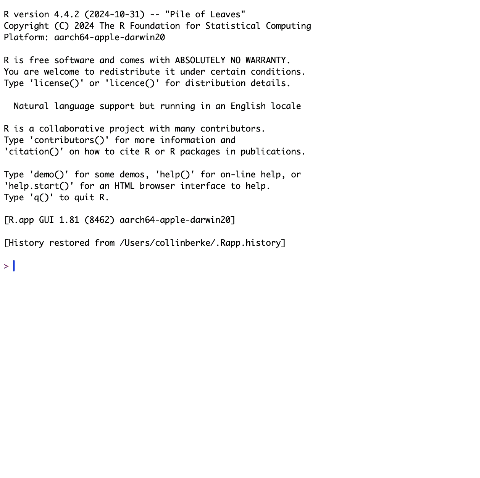
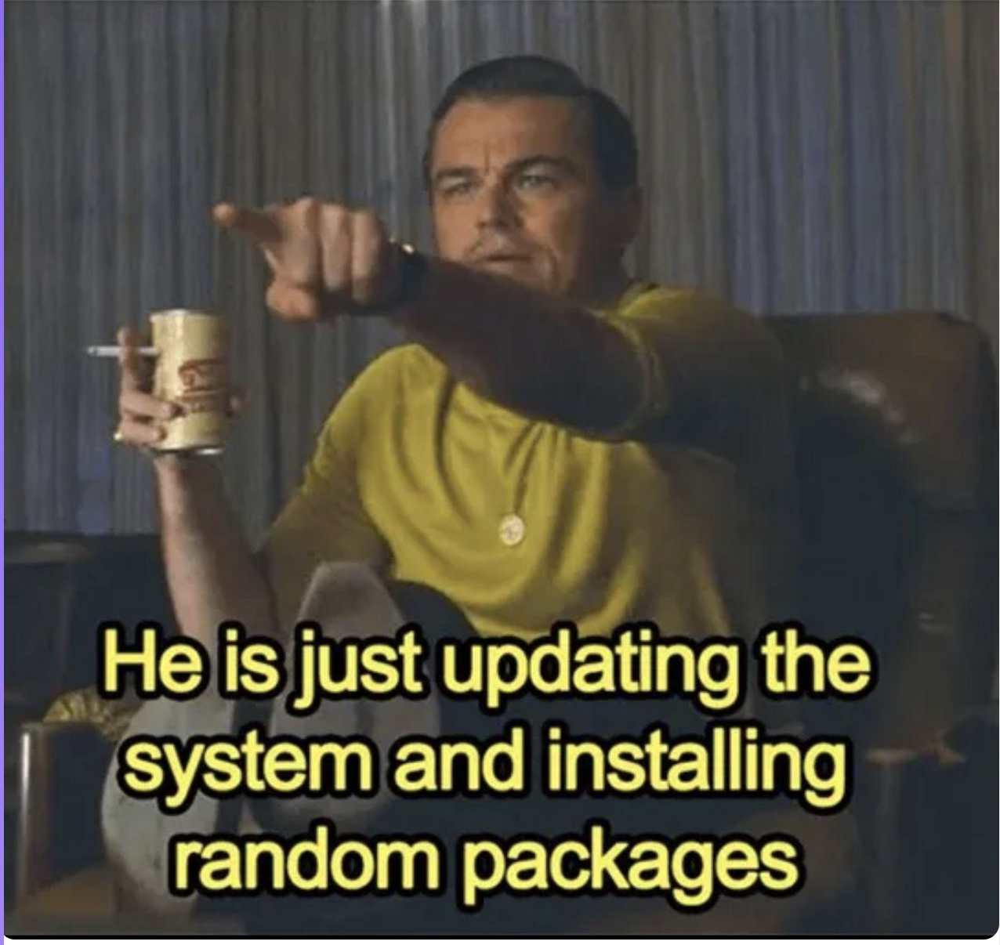
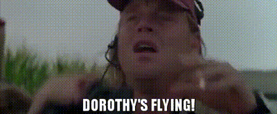
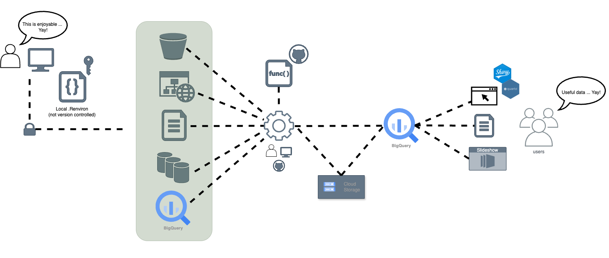
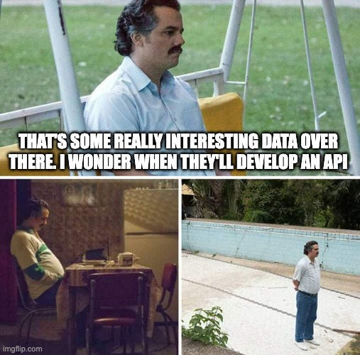
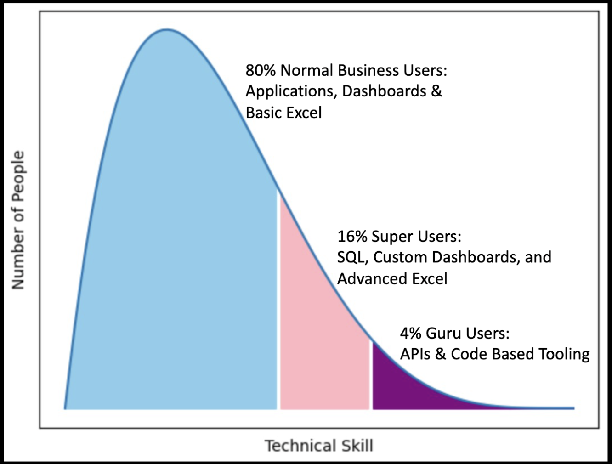
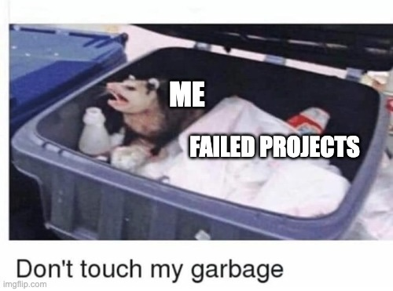

](images/thumbnail-wide.jpg){fig-align="center"}

# Background

This post is a recap from the [Nebraska R User Group](https://www.meetup.com/nebraskarusergroup/), [Failing upward with R: Challenges faced and hard truths learned by a small but scrappy data team on their journey to have an impact](https://www.meetup.com/neb-rug/events/307409136/), presented by [Collin K. Berke](https://www.collinberke.com/), Ph.D. on 2025-05-06.
This post (and perviously a talk), aimed to do the following:

* Introduce workflows a small, but scrappy data team uses to stay **RAD: Reporducible, Automated, and Documented**.
* Allow others to observe how a small, but scrappy data team utilizes R and other open-source tools to find efficiences and have a bigger impact.
* Inform others about the hard truths a small data team confronted when trying to leverage these tools.
* Convince attendees the impact internal R packages can have on their team's work.
* Show others how tools like Quarto can make your team more human, and your communication more effective.

**Here's the talk's abstract:**

*With the constant evolution of data science tools and the rapid rise in AI, it's sometimes beneficial--and at times refreshing--to step back and explore how the tools we use, and the ways we work, can have an impact.
So let's step back, revisit some basics, and talk about the fun stuff: workflows, data pipelines, project management, and--most importantly--people.*

*This talk's aim is to provide an overview of how we--a small but scrappy data team at a public media organization--leverage R and other open source tools to elevate our work and amplify our impact.
Besides hearing about some hard-earned wisdom from utilizing R in industry, you'll get the following by attending this presentation:*

- *Be introduced to workflows our team uses to stay RAD: Reproducible, Automated, and Documented.*

- *Observe how our team utilizes R and other open-source tools to find efficiencies and have a bigger impact.*

- *Commiserate as a community over the hard truths a small data team faces when trying to leverage these tools.*

- *Be convinced of the impact internal R packages can have on your team's work.*

- *Discover how tools like Quarto can make your team more human and your communication more effective.*

*And hey--you might even have a little fun, too! Stay tuned, and whatever you do ... don't touch that dial.*

**The slides from the talk can be viewed here:**

```{=html}
<iframe class="slide-deck" src="_presentation-fail_upward_r.html" height="420" width="747" style="border: 1px solid #2e3846;"></iframe>
```
The sections below provide a deeper explanation. Enjoy!

# Motivation

Let's take a trip.
Specifically, let's travel 8 hours and 34 minutes from [Lincoln, NE](https://en.wikipedia.org/wiki/Lincoln,_Nebraska)--give or take, depending on where in the world you're reading this--to an elevation of 7,244 feet: [Black Elk Peak, Custer State Park, South Dakota](https://en.wikipedia.org/wiki/Black_Elk_Peak), the highest summit east of the Rocky Mountains before the Pyrenees in France.
If you've summited this peak before, like I've done several times, you are aware of the decision you have to make at the start of your journey.
What trail do you take?

::: {#fig-custer-trails layout-ncol=2}
 rendering of Black Elk Peak's trails](images/custer-trails-google-earth.png){#fig-trail-black-elk}

](images/custer-park-trails.png){#fig-trail-info}

Black Elk Peak, Custer State Park, South Dakota hiking trails (click figures to enlarge)
:::

Those with a keen eye will probably spot the allegory behind these images right away: there's easy and hard ways to get where you're going.
At this point, many of you reading this post have likely come to the conclusion that "Collin's just here to espouse ideas on how to do things the easy way".
Although I sure wish I had that for you, that's not what's here.
Rather, what is here is a collection of hard truths and lessons a small, but scrappy data team learned from taking wrong, windy, and at times the hard paths on their journey to be more RAD (reproducible, automated, and documented), efficient, and a little more impactful.

::: {.callout-note}
This post is an overview of general workflows and data management practices that have worked for our team over the years.
Most of what's here is based on opinion.

Your mileage will vary ... 🚗💨

Moreover, there are likely better ways to do what's described here.
Let me know what they are, because I certainly want to be on the right path.
Find out how to connect with me [here](https://www.collinberke.com/).

No proprietary information or data is shared in this post.
:::

# Hard lessons learned

## Have a vision of where you're going

### Be useful

Riding the `install.packages()` wave is one of the most exhilarating experiences you have when beginning to use R.
Just for a moment, let's rewind time and relive this experience by witnessing the following GIF.

::: {#fig-install-wave}
{fig-align="center"}

Riding the `install.packages()` wave
:::

The hacker feeling is exhilarating (obviously a hacker for good, not bad).
It makes you feel like you're doing something cool.
Although this is exciting, reality sets in pretty quick ...

We actually have to do something useful with this.

::: {#fig-install-reality}
{height=300, width=300}

Meme depicting what's actually going on here
:::

Thus, the first task was to identify how and where tools like R could be leveraged in useful ways for the work we were doing.

### Keep the ideal state and end in mind

But we (mostly myself in the beginning) didn't know where the application of these tools would be the most useful.
I lacked vision, which resulted in several false starts.
Most noticeably, a gap existed between the tools we had available and the ideal end state we wanted to achieve (and in some places are still working on today).

We knew one thing: [Nebraska Public Media](https://nebraskapublicmedia.org/en/), where my team works, does some pretty rad things.
As such, we wanted to do some pretty *RAD* things as well, at least in terms of the data work we were doing.
This included being **R**eproducible, **A**utomated, and **D**ocumented.
By expressing this out loud, we were able to create a set of questions that served as a kind of framework:

- Can we--in a sensible way--reproduce past analysis and reporting?
- Are we automating everything that we can, while being mindful of the evils lurking around too much optimization?
- When we pivot, are we able to jump back into a project or data product easily?
- Will this work on another computer?
- Are we still being human?

Moreover, we had to best answer these questions while working in a dynamic industry that's constantly changing, a space where the tech, measurement, and audiences can be moving targets at times--the media industry.
I often liken our work to the movie [Twister](https://en.wikipedia.org/wiki/Twister_(1996_film)), where the plot is about a group of researchers attempting to deploy a device to measure a tornado (AKA [Dorthy](https://twister.fandom.com/wiki/Dorothy)).

> Melissa: How do you get it in the Tornado?
>
> Bill: Well you got to get in front of the tornado and put it in the damage path and then get out again before it picks you up to.
>
> -- Scene from Twister

Being aware of this, a question was raised: how can we still reach this ideal end state while also working within a tornado? The answer was internal R packages.

[Sharla Gelfand's Don't Repeat Yourself, talk to yourself! Reporting with R (talk)](https://www.youtube.com/watch?v=JThd3YYQXGg) was a good starting point.
It really laid out a nice solution to solve some of the problems we were facing, and it showed how our problems could be managed by creating internal R packages.
As a result, projects were organized into package structures.
This greatly aided in reproducibility.
In essence, we were creating our own Dorthys to solve our problems.

::: {#fig-dorthy-flying}
{fig-align="center" width=400 height=300}

The feeling we got when packages aided reproducibility
:::

Once reproducibility improved, the focus shifted to data accessibility.
This led us down the path of further iteration of our Extract, Transform, and Load (ETL) types of work.
These internal packages allowed us to go up a level of abstraction, where we were able to take these units of reproducible work and fit them into a somewhat more organized ETL structure.

::: {#fig-simple-etl}
{width=700 height=300}

A simplified ETL diagram showing the process of making data more accessible
:::

## Use a guide: Follow those who went before you

### Don't go it alone

Look to others who've gone before you.
Most likely your problems have already been solved, or someone has already come up with a solution that gets you pretty close to what you need.
Voices I turn to include:

   - [Hadley Wickham](https://bsky.app/profile/hadley.nz)
   - [Jenny Bryan](https://bsky.app/profile/jennybryan.bsky.social) (Is it truly an R talk if you don't mention Hadley or Jenny?)
   - [JD Long](https://bsky.app/profile/jdlong.cerebralmastication.com)
   - [Emily Riederer](https://bsky.app/profile/emilyriederer.bsky.social)
   - [Sharla Gelfand](https://www.sharlagelfand.com/)
   - And countless others ...

Indeed, many of the ideas here are taken directly from these individuals.

## Adversity is unavoidable, so identify ways to make work more enjoyable

### The environments you work in may not be set up for data science work

Dashboards and data portals for data extraction make me cringe 😬.

APIs and interfaces to submit queries makes me happy 😃.

We faced a harsh reality, though.

::: {#fig-api-waiting}


A hard lesson to learn
:::

Not every service or environment has the user base, resources, or even the need to develop these types of features.
Take for example the following plot shared in [JD Long's](https://bsky.app/profile/jdlong.cerebralmastication.com) posit::conf(2025) talk titled ["It's Abstracts All the Way Down..."](https://www.youtube.com/watch?v=Pa1PNfoOp-I).

::: {#fig-80-16-4}
{height=400, width=400}

The 80-16-4 rule
:::

Indeed, many of the tools and services my team interacts with tailor to the 80%, the typical business user.
Although convenient for typical business workflows and use cases, some tool's features limit how you can work with the data, and it can be inflexible when applied in other areas.
You have the tools to make the work in these environments more efficient and enjoyable.

### Use what you know to make things better

If you don't like something, use R to make it better ... or at least a little more enjoyable.
Keep in mind, R can be a tool to interact with the wider world outside of your current working session (I'm still trying to figure out how I can get it to order my groceries for me, though).

Smooth is fast. We live in a web-portal world, or at least the world my team interacts with on a regular basis is.
These portals require you to log in, click several series of buttons, and select a data export that is in a useful format, like a `.csv` file.
As such, many of these tools utilize URL endpoints to represent the final results of the workflow steps.
We found it more enjoyable and useful to wrap these workflows into several utility functions.

```{r}
#| label: example-get-function
#| eval: false

#' Open system browser to FCC's broadband data portal
#'
#' Convenience function to open a system browser window to
#' <https://https://broadbandmap.fcc.gov. Function is used
#' to quickly open the portal for data extraction tasks.
#'
#' @returns Opens a system browser window.
#' @examples
#' \dontrun{
#' # Open to FCC's data portal
#' get_broadband()
#'
#' # Open to a specific report in FCC's portal
#' get_broadband(year = 2024, month = "dec")
#' }
#' @export
get_broadband <- function(year = NULL, month = NULL) {
  portal_url <- "https://broadbandmap.fcc.gov/data-download/nationwide-data"

  if (is.null(year) || is.null(month)) {
    cli::cli_alert_info(
      glue::glue(
        "`month` and/or `year` not provided, opening browser to",
        portal_url,
        .sep = " "
      )
    )
    url <- portal_url
  } else {
    slug <- glue::glue("?version={month}{year}")
    url <- stringr::str_c(portal_url, slug)
  }

  browseURL(url)
}
```

::: {.callout-note}
The above code is an example of a public data portal that is accessible via a URL.

Indeed, there's an API available to access this data, so this is just meant to illustrate the point.
:::

Now, not only do we have these functions to rely on when we're in 'analysis mode', we also get the added benefit of being able to plug these functions into documentation.
As a result, it's easier for others--and likely our future selves--to review the documentation and run the needed functions to get our work done faster.

The need for long-winded documentation with extensive screen-grabs of all the clicks needed to export the analysis is no longer necessary.
All this mental overhead is abstracted away into nicely named functions, each providing analysts with utility for greater efficiency.

These utility functions are also helpful by putting docs closer to your finger tips, like making it faster and easier to access specific PDF documents.
Take the following as an example.

```{r}
#| label: example-open-documentation
#| eval: false

#' Open data dictionary file
#'
#' Convenience function to open a PDF version of the data dictionary.
#'
#' @returns Opens the PDF via the system's default PDF reader.
#' @examples
#' \dontrun{
#' # Open a PDF of the survey instrument
#' open_data_dictionary()
#' }
#'
#' @source <https://us-fcc.app.box.com/v/bdc-data-downloads-output>
#'
#' @export
open_data_dictionary <- function() {
  path <- here::here("vignettes/2025-05-05_broadband-data-dictionary.pdf")

  system(glue::glue("open -a 'google chrome' ", path))
}
```

## Have a plan, know where you're going (roughly)

### Make tough choices about project structure as early as possible

Make decisions about project structure right from the start.
Starting with a package structure is a good foundation, but you may need to modify the structure to fit your work.
One key tip: decide on places where different project materials will live right from the start.
Here's an example project structure we follow, using a toy example package I created for this talk.

```txt
.
├── DESCRIPTION
├── NAMESPACE
├── R
│   ├── get_broadband.R
│   ├── get_drive_data.R
│   └── ...
├── README.Rmd
├── comms
├── data
│   └── data_broadband.rda
├── data-raw
│   ├── 2025-05-05_2022-12-31_fcc_broad-band-map_mobile_nebraska.csv
│   ├── 2025-05-05_2022-12-31_fcc_broadband-map_mobile_nebraska.csv
│   ...
├── inst
│   ├── app
│   │   └── app.R
│   ├── reports
│   │   ├── 2025-05-05_report-mobile-broadband.qmd
│   │   ├── _output
│   │   │   └── 2025-05-05_report-mobile-broadband.pdf
│   │   └── _quarto.yml
│   └── sql
│       └── get_bq_broadband.sql
├── man
│   ├── get_broadband.Rd
│   ├── get_drive_data.Rd
│   ├── open_data_storage.Rd
│   └── vis_broadband_trend.Rd
├── tests
│   ├── testthat
│   └── testthat.R
└── vignettes
    ├── 2025-05-05_broadband-data-dictionary.pdf
    └── extract-broadband_data.Rmd
```

Some conventions we follow beyond a standard R package structure include:

- Having a `comms` directory to store any important communications we have with stakeholders of the project (not all of our projects utilize this, though).
- Utilizing the `inst` directory to store Shiny applications, reports, and SQL files used for queries.
- Utilizing `vignettes` for long-form documentation, like manual data extraction steps, and additional data related documentation.

::: {.callout-warning}
This is a very opinionated organizational structure.
Indeed, others may have other, better conventions they follow.
:::

You might also want to look to others who focus deeply in these areas.
In fact, you might find others in your domain already working on this topic.
Here's a few suggestions.

<blockquote class="bluesky-embed" data-bluesky-uri="at://did:plc:zxaobre6qygeskx6nr2ew6lu/app.bsky.feed.post/3lnxcdej23s22" data-bluesky-cid="bafyreibnmotdzf3hbbghexm42v5tpfrdb5jex7fnjpls3cvqa47kjc7xfa" data-bluesky-embed-color-mode="system"><p lang="en">Looking for ideas of how to structure a repository when publicly sharing data files from research projects?

I&#x27;ve created a sample project on @cos.io to help you think through this.  👇
#databs #edresearch

osf.io/59gte/<br><br><a href="https://bsky.app/profile/did:plc:zxaobre6qygeskx6nr2ew6lu/post/3lnxcdej23s22?ref_src=embed">[image or embed]</a></p>&mdash; Crystal Lewis (<a href="https://bsky.app/profile/did:plc:zxaobre6qygeskx6nr2ew6lu?ref_src=embed">@cghlewis.bsky.social</a>) <a href="https://bsky.app/profile/did:plc:zxaobre6qygeskx6nr2ew6lu/post/3lnxcdej23s22?ref_src=embed">Apr 29, 2025 at 7:38 AM</a></blockquote><script async src="https://embed.bsky.app/static/embed.js" charset="utf-8"></script>

[Emily Riederer's](https://bsky.app/profile/emilyriederer.bsky.social) blog and talk ["Building a team of internal R packages"](https://www.emilyriederer.com/post/team-of-packages/) is also a great resource.

### Create waypoints to know if you're on the right path

Now that you have the general structure for your projects, it's now important to create some type of signage to let you know if you're on the right path.
This involves your naming strategy, including how you name your files.
We turn to [Jenny Bryan's](https://bsky.app/profile/jennybryan.bsky.social) [holy trinity for naming files](https://www.youtube.com/watch?v=ES1LTlnpLMk) (seriously, take five minutes to change your life by watching this video). The holy trinity states file names should be:

- Machine readable
- Human readable
- Sorted in a useful way

The focus of this convention is to think in terms of greps, globs, and regular expressions.
Doing so makes finding things easier and more enjoyable to work within a project.

The other important consideration is creating sensible tests through the use of the [{testthat} package](https://testthat.r-lib.org/).
This is a pretty expansive topic, so it won't be discussed in depth here.
However, consider writing tests that at least catch the 'duh' things:

- Does the package's data contain the columns I expect?
- Are the columns the data types I expect?
- Does the data follow the structure I expect?

## Know when to pivot when you get lost

### Not all shiny things are useful or needed

We've all had that feeling--when a project gets messy and drifts away from its original intent.

::: {#fig-project-garbage}


How projects end up some times
:::

Indeed, there may be an urge to improve the project by adding more.
Perhaps you may be considering additions of the newest and shiniest tech to help improve the project.
Fight this urge.
Really consider what's needed for the project before adding more.

A good frame work is the pain scale shared by [Colin Gillespie's](https://bsky.app/profile/csgillespie.bsky.social) [Getting the Most Out of Git talk](https://www.youtube.com/watch?v=RwLxCk6bDnY).
Although this talk is mostly focused on the utilization of git within project workflows, I believe the pain scale applies to anything you want to add to a project.

::: {#fig-project-pain}


The level of pain inflicted if something goes wrong
:::

The premise is simple: determine how much pain will be inflicted if something goes wrong.
On the one hand, if you're working on a critical project that will create major pain and suffering if it fails, then you need to utilize additional tools and practices to avoid this pain and suffering at all costs. On the other hand, if your project fails and no one cares, do you really need the additional overhead?
Some project 'additions' I've added that should have been measured with this pain scale include:

* We need a full devops CI/CD pipeline for this Shiny app.
* Hey, we can manage our own Airflow instance for ETL pipelines.
* Perhaps this repo needs to follow a complex git branching structure for versions, features, and fixes.
* Oh, Docker should be easy to setup.

These certainly are not criticisms of these technologies or approaches, rather they were misplaced applications to projects that didn't necessitate this level of overhead for my team at the time.

## Take others along on your journey

### Be where your audience is

In the media industry, we have a saying: be where your audience is.
This also applies to your data work.
Really consider what stakeholders will find useful.
Does this include:

- A simple SQL query to extract data?
- A static PDF sent to an email?
- An arranged dataset in an Excel file?
- A fully functional Shiny app?
- An updatable slide deck presentation?

Not only is it important to figure out what type of output will engage people, you also need to consider where people spend most of their time.
Email?
Teams?
Slack?
Discord?
Or some type of internal wiki?
These spaces will dictate the types of output you can create.
Moreover, it might also require you to leverage some tricks to get things to work or to prop something up for someone.
[Quarto](https://quarto.org/) has been a big help, especially with its many output formats.
[Parameterized reports](https://3mw.albert-rapp.de/p/scalable-reporting-with-quarto) are another area that seems promising that we look to explore further.

### Be a human

The last lesson we learned is simple: identify ways to be more human.
This starts by taking time to observe how your data is being created and used.

Let's be real, at least in the context we work in, most people want the information they need to do a good job and get things done--towards the goal of contributing to the organization's ability to meet its mission.
As such, only build the things people need, not what you think they need.
This may require you to be a human and actually talk with the people who create, own, or use the data, and further discuss what their needs are.
And at times, you may need to create the first draft to get the conversation started and to prime the process of iteration. In short: create things useful to other people.

# Wrap up

> "Dèyè mòn, gen mòn"
>
> Beyond the mountains, more mountains
>
> -- Haitian proverb

Even though we've climbed some mountains as a team, there are still many yet to be submitted on our journey.
If you've stuck around this long, hopefully you found some wisdom here.
Certainly this post (or the talk) wasn't meant to have all the answers.
Rather it was a collection of hard truths learned through observation and experience.
Hopefully our failures (mostly mine because I have an awesome team) and the lessons we learned lead you to greater success.
At the very least, I hope what's here results in easier summits for you and your team.

If you're interested in these topics or want to show me a better way, let's connect:

* Come find me at a [Nebraska R User Group Meetup](https://www.meetup.com/nebraskarusergroup/)--no, seriously, come join us!
* Check out my blog at [collinberke.com](https://www.collinberke.com/)
* Connect with me on LinkedIn [@collinberke](https://www.linkedin.com/in/collinberke/)
* Follow me on GitHub [@collinberke](https://github.com/collinberke)
* Follow me on BlueSky [@collinberke.bsky.social](https://bsky.app/profile/collinberke.bsky.social)

